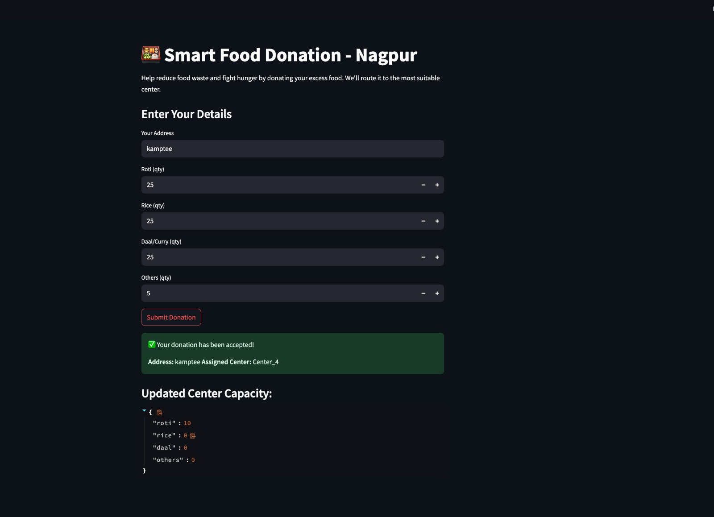

# 🍱 Smart Food Donation - Nagpur
> Help reduce food waste and fight hunger by donating excess food. Our KMeans-based intelligent system routes donations to the most suitable nearby center in Nagpur.

---

## 📌 Project Overview

Every day, a significant amount of edible food goes to waste while many continue to suffer from hunger. To bridge this gap, we developed a **Smart Food Donation System** that connects donors (households, restaurants, etc.) with NGOs or individuals in need using **Machine Learning (KMeans Clustering)**.

---

## 🎯 Objectives

- 📦 Reduce food wastage by connecting surplus food donors with centers in need.
- 🔀 Automate the routing of donations to the optimal distribution center.
- 🧠 Apply data science techniques (clustering) to improve efficiency.
- 🌍 Promote sustainable and responsible food management.

---

## 🛠️ Tech Stack

| Technology | Purpose                        |
|------------|--------------------------------|
| Python     | Core logic and data processing |
| Streamlit  | Frontend web interface         |
| scikit-learn | KMeans clustering algorithm  |
| Pandas, NumPy | Data handling & computation |
| JSON       | Capacity tracking & updates    |

---

## 📸 Screenshot – System in Action

> ✅ Your donation has been accepted! Assigned Center: `Center_4`  
> 🍛 Updated Center Capacity is shown instantly.

## 📌 Problem Statement

- Tons of edible food are wasted daily while hunger prevails.
- There is **no efficient digital system** to connect donors with NGOs or individuals instantly.
- Lack of real-time routing and coordination causes delays in food distribution.

---

## 💡 Solution

- ✅ A centralized, web-based system for **real-time food donation routing**.
- ✅ Uses **KMeans clustering** to match donations with optimal centers.
- ✅ Intuitive UI built with **Streamlit** to accept food quantity and address.
- ✅ Transparent updates on donation status and center capacity.

---

## 🧪 Methodology

1. **User Input**: Donor fills in food quantity and location.
2. **Clustering**: System clusters donation needs using KMeans.
3. **Routing**: Donation is assigned to the best-fit center with sufficient capacity.
4. **Capacity Update**: Real-time adjustment of center stock levels.

---

---
## 👨‍💻 Team
- Anshul Bhusari
- Ashish Sharma
- Shivam Verma
- Vishesh Chandok
